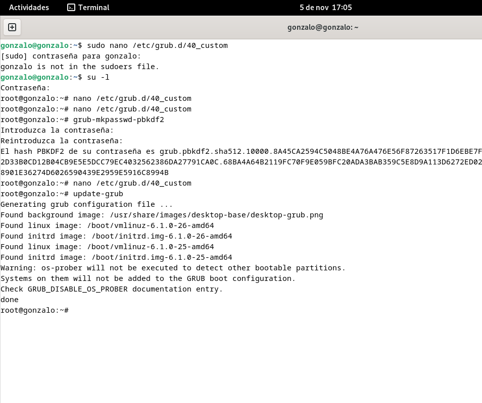

author: Gonzalo
summary: Proyecto BIOS
id: GonzaloPulido_BIOS
categories: codelab,markdown
environments: Web
status: Draft

# Arranque seguro Linux

## 1\. Añadir una Contraseña para Proteger GRUB 2

Configuraremos una contraseña para restringir el acceso a las opciones avanzadas de GRUB y evitar que usuarios no autorizados cambien los parámetros de arranque.

Primero abrimos el archivo 40_custom para añadir la configuracion de contraseña.

```bash
    sudo nano /etc/grub.d/40_custom
```

Añadiremos en este archivo las siguientes lineas para establecer el usuario y la contraseña de GRUB.

```plaintext
    set superusers="root"
    password root CONTRASEÑA
```

Y sustituiremos CONTRASEÑA por la clave segura que queramos.


Despues de editar el archivo 40_custom, pasaremos a cifrar la contraseña. Generamos el hash en la terminal con el siguiente comando.

```bash
    sudo grub-mkpasswd-pbkdf2
```

GRUB generará un hash, el cual, copiaremos.

Volvemos a abrir el archivo 40_custom para sustituir la linea pasword root CONTRASEÑA por la siguiente.

```plaintext
    password_pbkdf2 root <HASH_GENERADO>
```

Sustituiremos HASH_GENERADO por el hash que copiamos anteriormente.


Por ultimo, ejecutamos el siguiente comando para generar el archivo de configuración de GRUB y aplicar los cambios.

```bash
    sudo update-grub
```




## 2\. Proteger los Permisos del Archivo de Configuración de GRUB

En este paso, vamos a asegurar el archivo de configuracion, cambiando sus permisos para que solo el usuario root tenga acceso. Para ello, ejecutamos el siguiente comando.

```bash
    sudo chmod 700 /etc/grub.d/40_custom
```


Esto limitará el acceso a este archivo únicamente al usuario root, impidiendo que otros usuarios lo modifiquen.


## 3\. Ocultar el Menú de GRUB 2 en el Arranque

Para evitar que el menú de GRUB 2 sea visible durante el arranque y reducir el riesgo de acceso no autorizado, podemos reducir el tiempo de visualización a cero segundos.

Para ello, abrimos el archivo de cconfiguracion de GRUB con el siguiente comando.


```bash
    sudo nano /etc/default/grub
```

Configuramos el tiempo de espera del menu de GRUB escribiendo lo siguiente.

```plaintext
    GRUB_TIMEOUT=0
```


Por ultimo, guardamos el archivo de configuracion de grub con el siguiente comando.

```bash
    sudo update-grub
```


